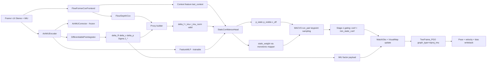
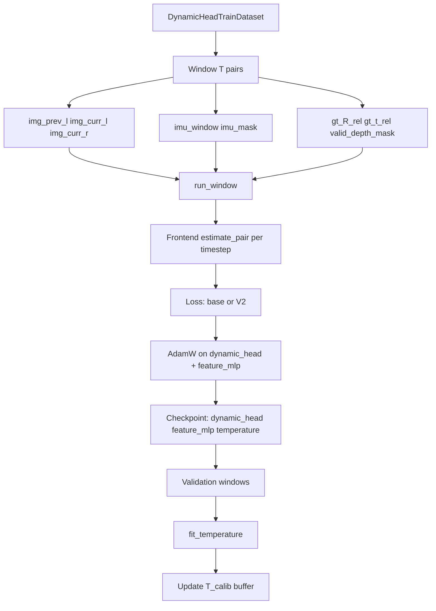
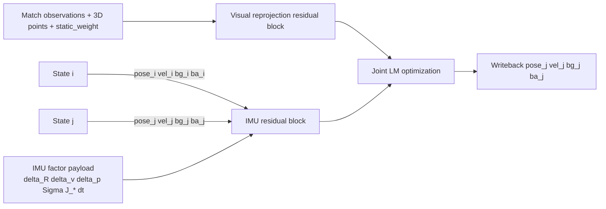

# Static-Confidence MAC-VO Runbook and Technical Architecture Report

This document is the canonical technical report for the **current** implementation under:

`dynamask_vio/macvo`

It includes:
- exact runtime/training behavior,
- architecture diagrams,
- tensor/data contracts,
- deployment/training commands,
- and known boundaries of the current system.

---

## 1. Current implementation status

### 1.1 Canonical code path

The maintained implementation is the MAC-VO-integrated stack in `dynamask_vio/macvo`.

The duplicate top-level static-confidence stack under `dynamask_vio/` was removed so there is a single authoritative path.

### 1.2 VIODE support (current)

**Supported via exported layout**:
- VIODE must be exported into a TartanAir-v2-like folder structure and loaded through `TartanAirv2`.

**Not currently used in this path**:
- raw rosbag-native VIODE ingestion inside `macvo` runtime/training.

---

## 2. Graphify architecture snapshot

From `graphify-out/GRAPH_REPORT.md` (2026-04-15):
- 8436 nodes, 18290 edges, 971 communities.
- God nodes include `Timer`, `IStereoDepth`, `IMatcher`, `main()`, `StereoFrame`, `StereoData`, `SequenceBase`.
- Relevant clusters for this implementation:
  - dynamic-head training dataset/loss flow (community containing `DynamicHeadTrainDataset`),
  - AirIMU module cluster (`AirIMUCorrector`, `load_airimu_weights`),
  - two-frame optimization graph cluster (`GraphInput`, `FactorGraph`, `Analytic_Reproj_*`).

---

## 3. System architecture (runtime)



### 3.1 Runtime stages

1. `StaticConfidence_FlowFormerCovFrontend.estimate_pair` runs frozen FlowFormerCov and consumes cached `last_context`.
2. IMU window is packed from frame IMU (or reused if prepacked), then passed to `AirIMUEncoder`.
3. Frontend builds per-pixel IMU-rigid proxy channels and runs `StaticConfidenceHead`.
4. Frontend attaches to `match_out`:
   - `static_conf`, `static_weight`, `static_logit`, `p_static`, `p_visible`,
   - `imu_preintegration` payload (`delta_*`, `Sigma_preint`, Jacobians, `dt`).
5. `MACVO.run_pair` samples confidence/weight at keypoints and applies hard Stage-1 gating.
6. Matches + map points + IMU factor are inserted into `VisualMap`.
7. Optimizer runs `TwoFrame_PGO` with `graph_type: reproj_imu`, writes back pose and inertial states.

---

## 4. System architecture (training + calibration)



### 4.1 Trainable vs frozen policy

- Frozen:
  - FlowFormer backbone (`frontend.model`)
  - AirIMU corrector (`frontend.imu_encoder.corrector`)
- Trainable:
  - `frontend.dynamic_head`
  - `frontend.imu_encoder.feature_mlp`
- Assertions enforce this at startup (`Train/DynamicHead/train.py`).

---

## 5. Backend optimization graph



### 5.1 Residuals used in `ReprojIMU_TwoFramePGO`

- Visual: `w * reprojection_error`, where `w` is sampled `static_weight` (fallback `static_conf`).
- IMU: 15D preintegration residual:
  - rotation residual with bias Jacobian correction,
  - velocity residual,
  - position residual,
  - gyro and accel bias random-walk residuals.

### 5.2 Covariance weighting

- Visual per-observation covariance blocks from pixel uncertainty.
- IMU factor covariance:
  - top-left 9x9 from `Sigma_preint`,
  - bias RW blocks from `sigma_bg_rw`, `sigma_ba_rw`.
- Optimizer builds block-diagonal inverse covariance and runs LM.

---

## 6. Module-level technical breakdown

### 6.1 Frontend integration

`Module/Frontend/Frontend.py` (`StaticConfidence_FlowFormerCovFrontend`)

- Loads static-head checkpoint with keys:
  - `head_state_dict` (legacy) or `dynamic_head` (current),
  - optional `feature_mlp`, `temperature`.
- Keeps stream state:
  - recurrent hidden state,
  - timestamp-based stream reset (`dt_reset_ms`).
- Builds proxy channels:
  - `delta_f_x`, `delta_f_y`, `r_imu`, `r_imu_norm`, `valid`.
- Produces and exports:
  - full-res `static_conf` / `static_weight`,
  - dual-head probabilities (if configured),
  - backend IMU payload.

### 6.2 AirIMU branch

`Module/Network/AirIMU/`

- `corrector.py`: frozen CodeNet-style IMU corrector, robust checkpoint resolution/loading.
- `preintegration.py`: differentiable Forster-style recursion with Jacobians:
  - `J_R_bg`, `J_v_bg`, `J_v_ba`, `J_p_bg`, `J_p_ba`.
- `encoder.py`:
  - runs corrector under `torch.no_grad()`,
  - preintegrates corrected IMU,
  - projects preintegration summary to `f_imu` via trainable `FeatureMLP`.

### 6.3 Dynamic head

`Module/Network/DynamicHead/`

- Input stack (default):
  - context(128) + flow(2) + cov(3) + proxy(5).
- IMU fusion options:
  - `none`, `concat`, `film`, `depth_bin_film` (default), `cross_attention`.
- Temporal core:
  - ConvGRU / ConvLSTM / none.
- Output modes:
  - single-output static or dual-output `(static, visible)`.
- Optional H/4 refinement:
  - depthwise-separable refinement with image gradient cues.
- Solver-facing map weight:
  - monotonic piecewise mapper `w = g(c_eff)` with floor `w_eps`.

### 6.4 Training loop and losses

`Train/DynamicHead/`

- `DynamicHeadTrainDataset` yields windowed supervision with camera-frame relative GT pose.
- `run_window` iterates sequential windows and resets recurrent stream per window.
- Base loss (`compose_total_loss`):
  - `L_dyn` (focal BCE with GT rigid residual target),
  - `L_smooth` (edge-aware smoothness),
  - `L_cyc` (cycle-consistency BCE target).
- V2 loss (`compose_total_loss_v2`):
  - `L_static`, `L_visible`, `L_joint`, `L_smooth(c_eff)`.
- Post-hoc temperature calibration:
  - `fit_temperature` optimizes `T_calib` on held-out windows.

### 6.5 Odometry and map wiring

`Odometry/MACVO.py`, `Module/Map/VisualMap.py`, `Module/Map/Template.py`

- Frame state now includes:
  - `pose`, `vel_w`, `bias_g`, `bias_a`.
- Match state now stores:
  - `static_conf`, `static_weight`.
- IMU factor store added with edges linking factor to `(frame_i, frame_j)`.
- Stage-1 hard gating in `run_pair`:
  - drops observations where `static_conf <= min_static_conf`.
- Stage-2 soft weighting:
  - solver uses `static_weight` in visual residual term.

---

## 7. Data contracts and tensor shapes

### 7.1 Frontend input contract

- Stereo frame provides:
  - `imageL`, `imageR`, `K`, `baseline`, `frame_ns`.
- IMU is accepted as:
  - prepacked `imu_window[B,N,7] + imu_mask[B,N]`,
  - or raw frame IMU object (`time_ns`, `acc`, `gyro`) for on-the-fly packing.

### 7.2 Training dataset output

For each window of length `T`:
- `img_prev_l`, `img_curr_l`, `img_curr_r`: `[T,3,H,W]`
- `K`: `[T,3,3]`, `baseline`: `[T]`
- `imu_window`: `[T,M,7]`, `imu_mask`: `[T,M]`
- `gt_R_rel`: `[T,3,3]`, `gt_t_rel`: `[T,3]`
- `valid_depth_mask`: `[T,1,H,W]`

---

## 8. Configuration and execution

### 8.1 Training config

`Config/Experiment/StaticConfidenceHead/viode.yaml`

- Frontend: `StaticConfidence_FlowFormerCovFrontend`
- Loss: base + V2 blocks configured together
- Train data: `TartanAirv2` source at exported VIODE root
- Val data: EuRoC

### 8.2 Runtime odometry config

`Config/Experiment/StaticConfidenceHead/MACVO_StaticConfidence.yaml`

- Enables dynamic gating and static-confidence frontend.
- Backend graph set to `reproj_imu`.
- Loads trained head checkpoint by default:
  - `./Model/StaticConfidenceHead/latest.pth`.

### 8.3 Commands

Train head:

```bash
cd dynamask_vio/macvo
python -m Train.DynamicHead.train --config Config/Experiment/StaticConfidenceHead/viode.yaml
```

Run MAC-VO (VIODE-export sequence):

```bash
python MACVO.py \
  --odom Config/Experiment/StaticConfidenceHead/MACVO_StaticConfidence.yaml \
  --data Config/Sequence/VIODE_Export_Example.yaml
```

Run MAC-VO (EuRoC):

```bash
python MACVO.py \
  --odom Config/Experiment/StaticConfidenceHead/MACVO_StaticConfidence.yaml \
  --data Config/Sequence/EuRoC_MH01.yaml
```

---

## 9. Required checkpoints and paths

From `dynamask_vio/macvo`:

1. FlowFormerCov frontend checkpoint  
   `./Model/MACVO_FrontendCov.pth`
2. AirIMU corrector checkpoint  
   `./weights/airimu.pth`
3. Trained static head checkpoint  
   `./Model/StaticConfidenceHead/latest.pth`

Current training save format:
- `dynamic_head`
- `feature_mlp`
- `temperature`
- `config_path`

---

## 10. Known boundaries of current implementation

1. VIODE input is currently expected in exported TartanAir-v2-style structure.
2. Backend optimizer is still a two-frame graph (`TwoFrame_PGO`), not a multi-keyframe sliding window.
3. IMU covariance random-walk terms are currently fixed defaults (`1e-3`) unless edited in code/config.

---

## 11. Canonical active code map

- `macvo/Module/Frontend/Frontend.py`
- `macvo/Module/Network/AirIMU/*`
- `macvo/Module/Network/DynamicHead/*`
- `macvo/Train/DynamicHead/*`
- `macvo/DataLoader/Dataset/DynamicHeadTrain.py`
- `macvo/Odometry/MACVO.py`
- `macvo/Module/Map/{Template.py,VisualMap.py}`
- `macvo/Module/Optimization/TwoFramePGO/{Graphs.py,Optimizer.py}`
- `macvo/Config/Experiment/StaticConfidenceHead/*`

Everything above is the implementation surface you should treat as authoritative for future changes.
